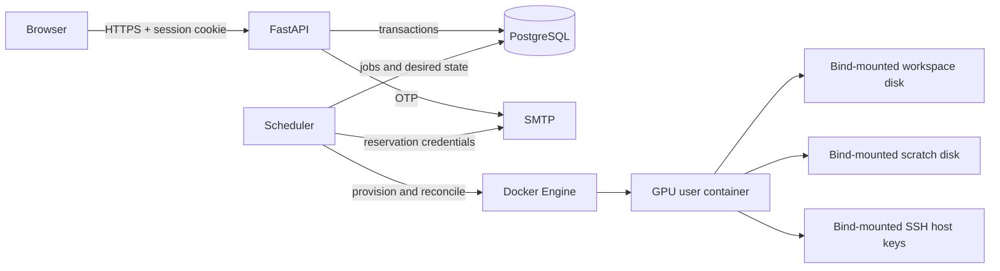
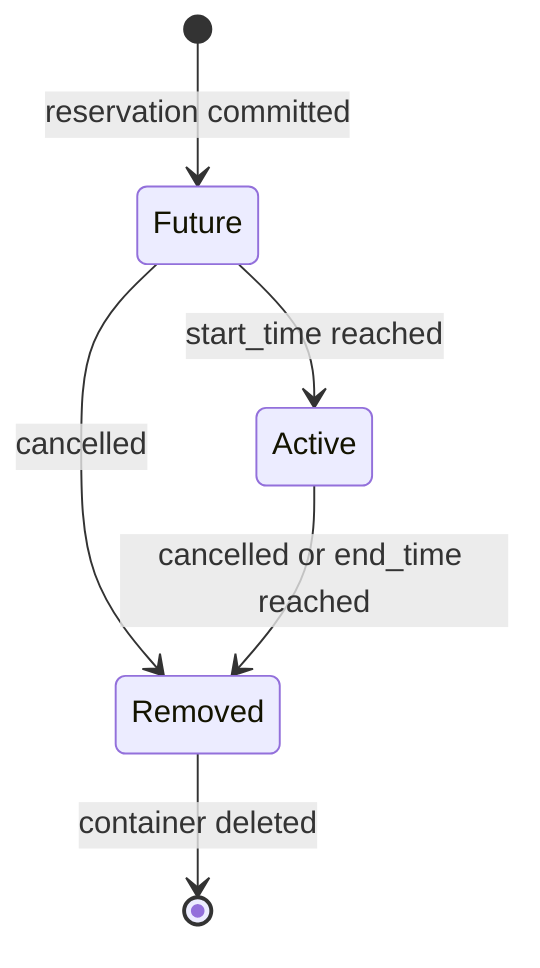

# Architecture

OpenGPU separates authenticated intent from privileged container control. PostgreSQL is the source of truth shared by an unprivileged API and a Docker-capable scheduler.

## Components

- The browser renders the custom booking timeline and calls same-origin JSON endpoints.
- The API authenticates, validates, books, cancels, and reports health. It never calls Docker.
- PostgreSQL enforces reservation rules and coordinates concurrent API and scheduler workers.
- The scheduler is the only application process that needs Docker access.
- Docker runs one labelled GPU container for the active reservation.
- SMTP delivers login codes and reservation-specific SSH credentials.

## Authentication and booking

1. An email requests access. Approved addresses receive a six-digit code; unapproved addresses are directed to the configured administrator.
2. The newest valid challenge is checked under a row lock. Successful verification stores only a hash of a random session token and sets an HTTP-only cookie.
3. The browser loads `/me` and future reservations. Other users' reservation IDs are withheld.
4. The first booking attempt for an unprovisioned user queues initial provisioning and returns `202`.
5. After provisioning becomes `ready`, the user submits the booking again with an idempotency key.
6. PostgreSQL inserts the reservation and queues reservation provisioning, which rotates the SSH password and emails the new credentials.

## Reservation lifecycle

Future reservations retain their pre-provisioned stopped container. At the start time the scheduler starts it. Cancellation or expiry removes the container rather than merely stopping it. `/workspace` data remains in the user's sparse image; scratch disks and loop mounts are released when no current or future reservation remains. SSH host keys stay in their host directory.

## Consistency model

- The global PostgreSQL exclusion constraint prevents overlapping non-cancelled reservations.
- A trigger rejects past reservations, disabled users, and a second current/future booking for one user.
- The API locks the user row while deciding provisioning and booking state.
- One provisioning job row exists per user; workers claim rows with `FOR UPDATE ... SKIP LOCKED`.
- A PostgreSQL advisory lock permits only one scheduler leader.
- Docker resources are adopted or mutated only when their application and user labels match.
- Audit events record authentication, bookings, cancellations, provisioning, transitions, and administration.

## Failure behavior

- Provisioning failures become retryable after one minute and are visible through `teams.provisioning_state`.
- SMTP failure during credential delivery removes the incomplete container because plaintext passwords are never retained.
- A stale scheduler heartbeat or a recorded reconciliation error makes readiness return `503`.
- If the scheduler leadership connection dies, the process exits instead of running without the lock.
- Unmanaged containers and incorrectly owned storage volumes are rejected rather than silently adopted.
