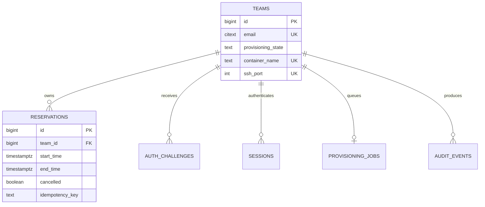

# Database

PostgreSQL stores identity, authentication, reservations, provisioning state, audit history, and scheduler health. Application correctness depends on database constraints as well as Python checks.

## Relationships

`service_heartbeats` is keyed by service name and is independent of a user.

## Tables

- `teams`: one approved person, generated Docker/SSH identifiers, enabled state, provisioning state, and last error.
- `reservations`: time range, cancellation metadata, and per-user idempotency key.
- `auth_challenges`: hashed OTP, expiry, attempt count, and consumption time.
- `sessions`: hashed session token, expiry, and revocation time.
- `provisioning_jobs`: one mutable job per user with purpose, state, attempts, retry time, and last error.
- `audit_events`: append-only application and administration events with JSON details.
- `service_heartbeats`: scheduler freshness and most recent reconciliation error.

## Enforced reservation rules

- `end_time` must be after `start_time`. The authenticated API enforces `RESERVATION_LIMIT_MINUTES` for standard bookings and records `duration_override` for administrator-authorized longer reservations.
- Non-cancelled ranges cannot overlap globally; adjacent half-open ranges are allowed.
- A trigger rejects reservations beginning in the past.
- The owning user must exist and be enabled.
- One user may have only one non-cancelled current or future reservation.
- One idempotency key may identify only one reservation per user.

The trigger locks the owning team row, which serializes concurrent booking attempts for the same user. The exclusion constraint provides global overlap safety across users.

## Schema changes

`postgres/init.sql` is the complete fresh-install schema. Existing installations use numbered forward and rollback migrations. Any schema contribution must:

1. Update `init.sql` for new installations.
2. Add an idempotent forward migration for existing installations.
3. Add a safe rollback or explicitly refuse unsafe rollback.
4. Add tests against a database whose name ends in `_test`.
5. Preserve data and constraints under concurrent requests.

Never point `scripts/run-tests.sh` at a production database. The runner checks `TEST_MODE=true`, and database fixtures independently reject non-test database names.
